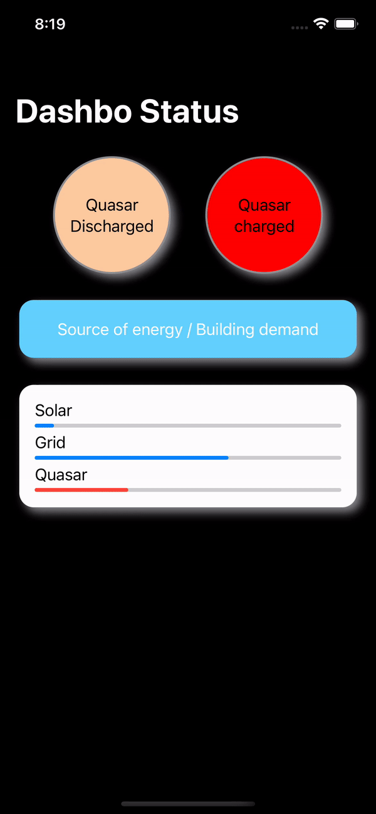

# My EnergyManagementSystemSwiftUI Practice

[(https://img.shields.io/github/license/Jonashio/EnergyManagementSystemSwiftUI)](https://img.shields.io/github/license/Jonashio/EnergyManagementSystemSwiftUI) | https://img.shields.io/badge/dependencies-SwiftLint-green | https://img.shields.io/badge/Platform%20Compatibility-iOS-red | https://img.shields.io/badge/Lenguage-SwiftUI-yellow


The first screen is a dashboard that holds different widgets of an energy management system (EMS). The widgets allow you to observe the different sources of energy and the amount of energy overtime.

Here is just a small sampling of practice:



## Used Libraries

* [**lottie-ios**](https://github.com/airbnb/lottie-ios)
* [**SwiftLint**](https://github.com/realm/SwiftLint)
* [**SwiftUICharts with SwiftPackageManager**](https://github.com/willdale/SwiftUICharts)

## Installation

* Download the project.
* Open the terminal and navigate to the directory of project ```cd EnergyManagementSystemSwiftUI```.
* Install Dependencies with Cocoapods ```pod install```.
* Open the workspace ```open EnergyManagementSystemSwiftUI.xcworkspace```.
  
## Author

* [**Jonashio**](https://github.com/Jonashio)